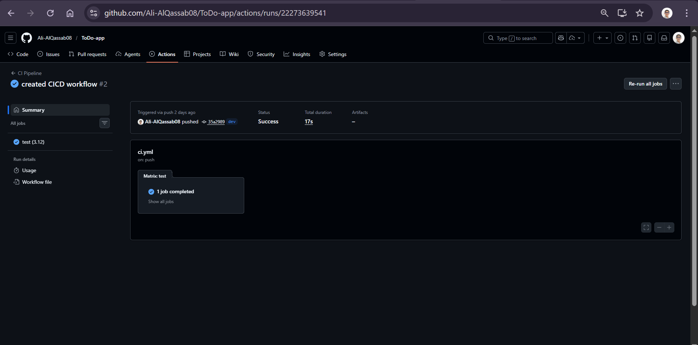
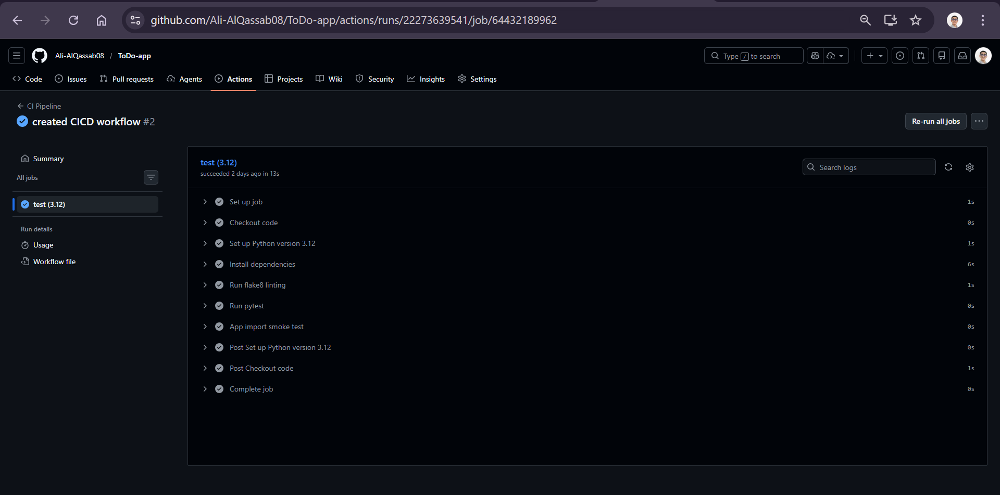
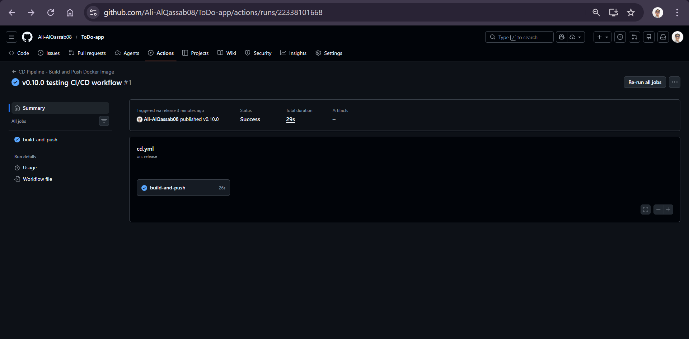
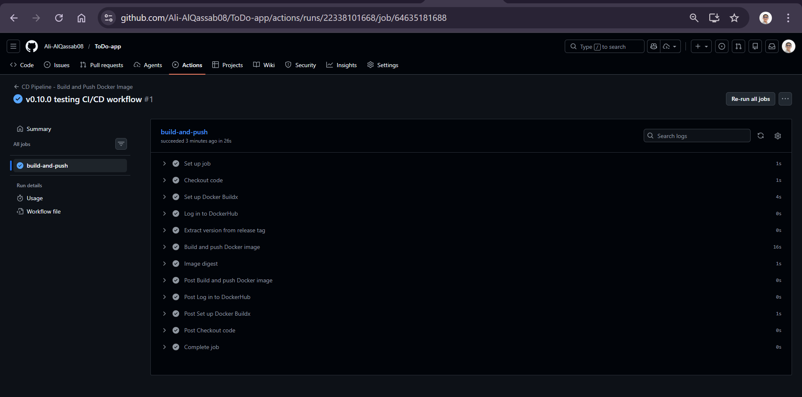
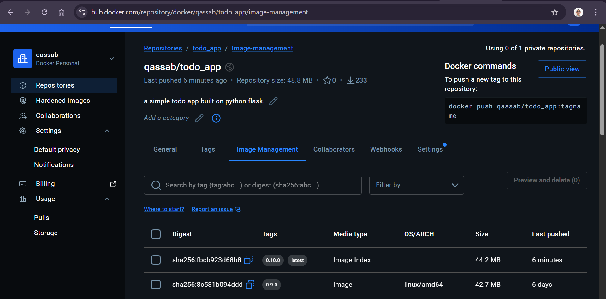
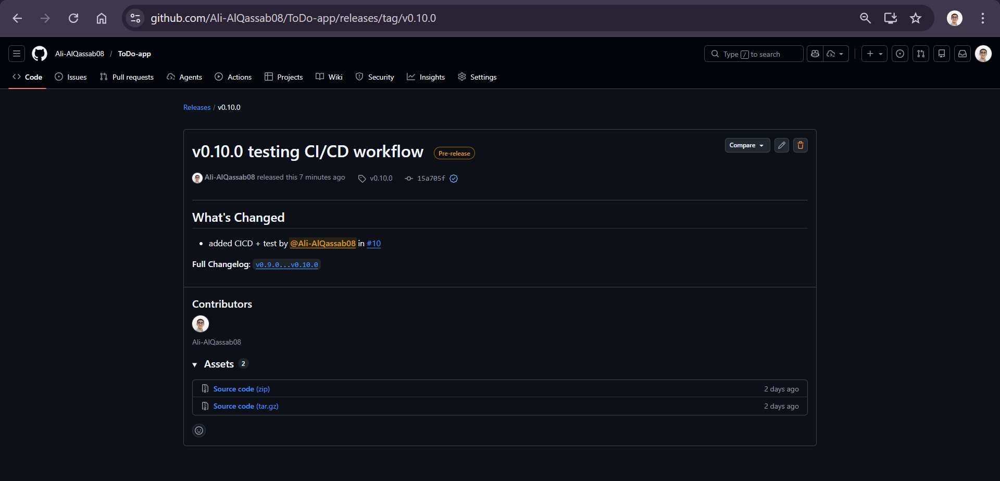

# CI/CD Submission - ToDo App

**Student Name:** [Ali AlQassab]  
**Date:** February 22, 2026  
**Course:** [CC302]

---

## Table of Contents
1. [CI Workflow (ci.yml)](#ci-workflow-ciyml)
2. [CD Workflow (cd.yml)](#cd-workflow-cdyml)
3. [Docker Image on DockerHub](#docker-image-on-dockerhub)
4. [GitHub Release](#github-release)
5. [Reflection: What I Learned](#reflection-what-i-learned)

---

## CI Workflow (ci.yml)

### Workflow File

The CI pipeline runs on every push and pull request to the `main` and `dev` branches. It performs linting with flake8, runs pytest unit tests, and validates that the app imports correctly.

**File Location:** `.github/workflows/ci.yml`

```yaml
name: CI Pipeline

on:
  push:
    branches:
      - main
      - dev
  pull_request:
    branches:
      - main
      - dev

jobs:
  test:
    runs-on: ubuntu-latest
    strategy:
      matrix:
        python-version: ['3.12']

    steps:
      - name: Checkout code
        uses: actions/checkout@v4

      - name: Set up Python version ${{ matrix.python-version }}
        uses: actions/setup-python@v5
        with:
          python-version: ${{ matrix.python-version }}

      - name: Install dependencies
        run: |
          python -m pip install --upgrade pip
          pip install -r requirements.txt

      - name: Run flake8 linting
        run: |
          flake8 . --count --select=E9,F63,F7,F82 --show-source --statistics
          flake8 . --count --max-line-length=120 --exit-zero --statistics

      - name: Run pytest
        run: |
          pytest tests/ -v --tb=short

      - name: App import smoke test
        run: |
          python -c "from app import app; print('✓ App imports successfully')"
```

### Screenshot of Successful CI Run




**Description:** The screenshot above shows a successful CI pipeline run where all tests passed, linting completed without critical errors, and the app import smoke test succeeded.

---

## CD Workflow (cd.yml)

### Workflow File

The CD pipeline is triggered when a new release is published on GitHub. It builds a Docker image, tags it with the release version and `latest`, and pushes it to DockerHub.

**File Location:** `.github/workflows/cd.yml`

```yaml
name: CD Pipeline - Build and Push Docker Image

on:
  release:
    types: [published]

jobs:
  build-and-push:
    runs-on: ubuntu-latest

    steps:
      - name: Checkout code
        uses: actions/checkout@v4
        with:
          fetch-depth: 0

      - name: Set up Docker Buildx
        uses: docker/setup-buildx-action@v3

      - name: Log in to DockerHub
        uses: docker/login-action@v3
        with:
          username: ${{ secrets.DOCKERHUB_USERNAME }}
          password: ${{ secrets.DOCKERHUB_TOKEN }}

      - name: Extract version from release tag
        id: version
        run: |
          VERSION=${GITHUB_REF#refs/tags/v}
          echo "version=$VERSION" >> $GITHUB_OUTPUT
          echo "Docker image will be tagged as: $VERSION"

      - name: Build and push Docker image
        uses: docker/build-push-action@v5
        with:
          context: .
          push: true
          tags: |
            ${{ secrets.DOCKERHUB_USERNAME }}/todo_app:${{ steps.version.outputs.version }}
            ${{ secrets.DOCKERHUB_USERNAME }}/todo_app:latest
          cache-from: type=gha
          cache-to: type=gha,mode=max

      - name: Image digest
        run: echo ${{ steps.docker_build.outputs.digest }}
```

### Screenshot of Successful CD Run



**Description:** The screenshot above shows a successful CD pipeline run triggered by a GitHub release. The Docker image was built and pushed to DockerHub with the appropriate version tag.


---

## Docker Image on DockerHub

### Screenshot of DockerHub Repository



**Description:** The screenshot above shows the DockerHub repository with the newly pushed image tags. You can see:
- The version tag from the release (`v0.10.0`)
- The `latest` tag
- The image size and upload timestamp

**DockerHub Repository:** `qassab/todo_app`

---

## GitHub Release

### Screenshot of GitHub Release



**Description:** The screenshot above shows the GitHub release page with:
- Release version and tag (`v0.10.0`)
- Release notes describing the changes
- Assets attached to the release
- The release triggering the CD pipeline

---

## Reflection: What I Learned

### GitHub Actions and Automation

Through this project, I gained hands-on experience with GitHub Actions and learned valuable lessons about CI/CD automation:

**Continuous Integration (CI):** I learned how to set up automated testing pipelines that run on every code change. The CI workflow helped catch bugs early by automatically running linting checks and unit tests before code could be merged. This gave me confidence that the codebase maintains quality standards and prevents breaking changes from being introduced.

**Continuous Deployment (CD):** Implementing the CD pipeline taught me how to automate the build and deployment process. By triggering Docker image builds on GitHub releases, I eliminated manual deployment steps and reduced the chance of human error. The integration with DockerHub made it easy to version and distribute the application.

**Best Practices:** I learned the importance of workflow optimization, such as using matrix strategies for testing multiple Python versions, caching dependencies to speed up builds, and using secrets to securely manage credentials. I also gained experience with Docker best practices like multi-stage builds and image tagging strategies.

Overall, this project demonstrated how automation through GitHub Actions can significantly improve development workflows, ensure code quality, and streamline the deployment process. These are essential skills for modern software development practices.

---

## Additional Notes

### Repository Information
- **Repository:** Ali-AlQassab08/ToDo-app
- **Branch Structure:** `main` (production), `dev` (development)
- **CI Triggers:** Push and pull requests to `main` and `dev` branches
- **CD Trigger:** Published releases

### Technologies Used
- **CI/CD Platform:** GitHub Actions
- **Testing Framework:** pytest
- **Linting:** flake8
- **Containerization:** Docker
- **Container Registry:** DockerHub
- **Programming Language:** Python 3.12
- **Application Framework:** Flask

