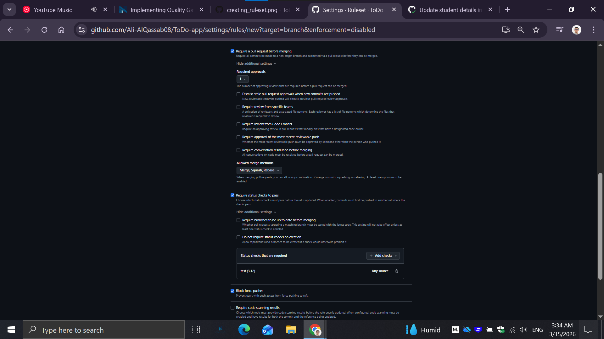
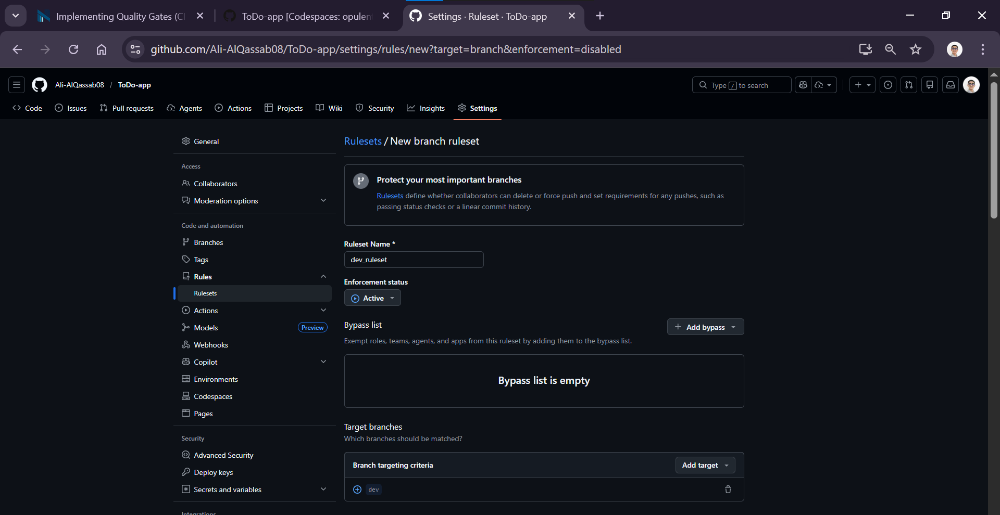
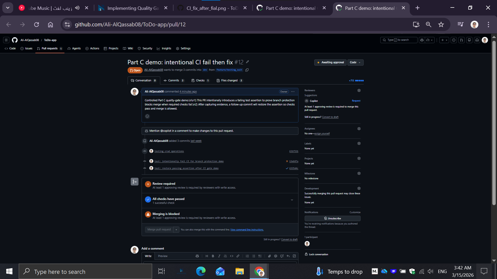
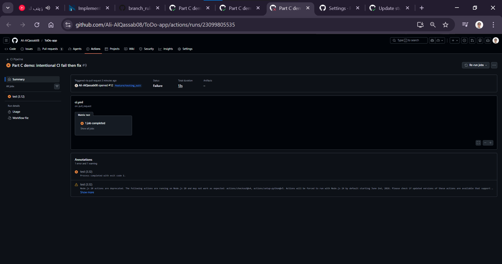
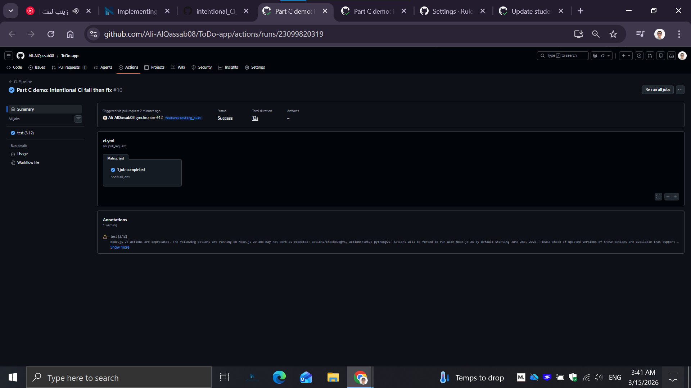
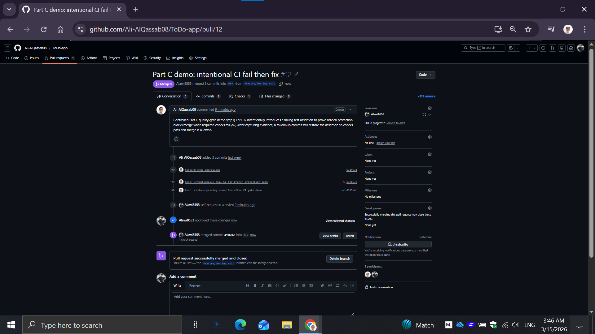

# FA Submission: Branch Protection and CI Quality Gate

**Student Name:** Ali AlQassab  
**Course:** CC302  
**Date:** March 15, 2026  
**Repository:** https://github.com/Ali-AlQassab08/ToDo-app  
**PR Link (feature -> dev):** https://github.com/Ali-AlQassab08/ToDo-app/pull/12

---

## 1) Branch Protection / Ruleset Evidence

This screenshot shows the branch protection configuration with pull request requirement and required status checks enabled.

Additional setup screenshot:

---

## 2) Evidence That Merge Was Blocked (Failed CI)

This screenshot shows the PR in a blocked state when CI failed.

Additional failed CI evidence:

---

## 3) Evidence That Merge Became Allowed (Passed CI)

This screenshot shows CI passing after the fix.

Additional review/approval and ready-to-merge state evidence:

---

## 4) Short Explanation (Detailed Answers)

### What failed?
A controlled failure was introduced in the test suite on the feature branch to prove that the quality gate works. Specifically, one assertion in `tests/test_app.py` was intentionally changed to expect HTTP `201` for the index route (`GET /`), while the real endpoint correctly returns `200`. This caused the CI job `test (3.12)` in the `CI Pipeline` workflow to fail on the pull request run. The failed run provided direct evidence that the workflow catches incorrect behavior before merge.

### Why was merge blocked?
Merge was blocked because branch protection on `dev` requires successful status checks before merging. When the required check `test (3.12)` failed, GitHub marked the PR as blocked and did not allow merge. This demonstrates the core purpose of branch rules: even if code is pushed and a PR exists, the branch policy prevents integration of changes that do not pass automated quality checks.

### What did you change to pass?
The intentional failing assertion was corrected back to the valid expected status code (`200`) in the same PR branch. After pushing this fix commit, CI ran again automatically and the required check passed (green). Once the check passed, the quality-gate condition for status checks was satisfied, and the PR moved from failed-check state to merge-eligible state (subject to any additional repository policies such as required review).

---

## 5) Summary of the Fail -> Block -> Fix -> Pass Flow

1. Created feature-branch PR into `dev`.
2. Introduced a safe, intentional test assertion failure.
3. CI failed and PR showed blocked merge due to required checks.
4. Corrected the assertion in the same PR.
5. CI re-ran and passed.
6. PR became compliant with required status check gate.

This confirms the repository quality gate is functioning correctly.
