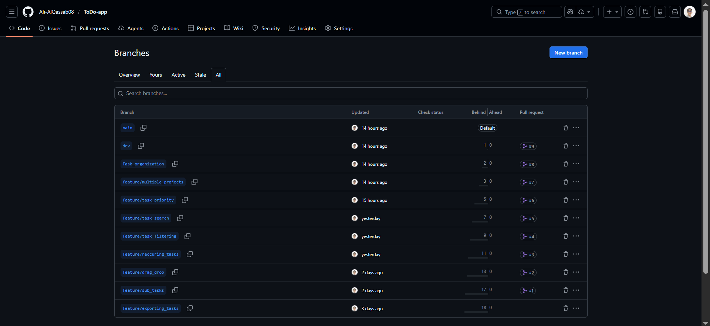
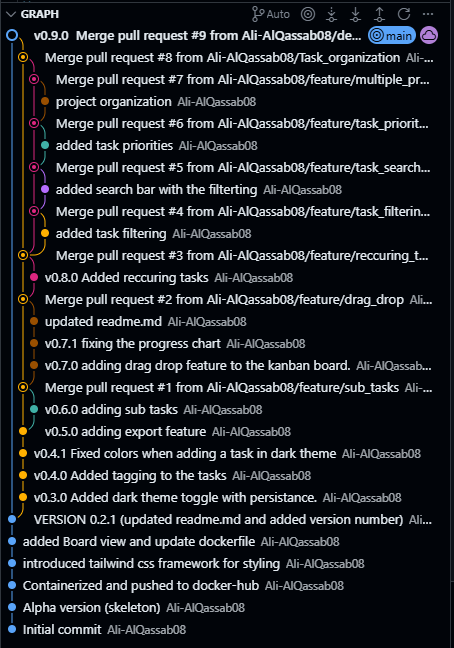

# 📋 PRD Submission Proof - Daily Flow To-Do App v0.9.0

**Student:** Ali-AlQassab08  
**Repository:** https://github.com/Ali-AlQassab08/ToDo-app  
**Submission Date:** February 18, 2026

---

## ✅ Phase 1-3: Project Setup & Branch Strategy

### Repository Information
- **Repository Name:** ToDo-app
- **Main Branch:** main
- **Dev Branch:** dev (created from main)
- **Features Branch** feature (created from dev)
- **Application:** Flask-based Daily Flow Task Management App with advanced features

---

## ✅ Branch Structure

```
main (production)
 └── dev (integration)
      ├── feature/sub_tasks
      ├── feature/drag_drop
      ├── feature/reccuring_tasks
      ├── feature/task_filtering
      ├── feature/task_search
      ├── feature/task_priority
      ├── feature/multiple_projects
      ├── feature/Tags_Categories
      ├── feature/exporting_tasks
      └── feature/dark_theme
```

**Evidence Command:**
```bash
git branch -a
```

**Result:**
```
  Task_organization
  dev
  feature/Tags_Categories
  feature/drag_drop
  feature/exporting_tasks
  feature/multiple_projects
  feature/reccuring_tasks
  feature/sub_tasks
  feature/task_filtering
  feature/task_priority
  feature/task_search
* main
  remotes/origin/HEAD -> origin/main
  remotes/origin/Task_organization
  remotes/origin/dev
  remotes/origin/feature/Tags_Categories
  remotes/origin/feature/dark_theme
  remotes/origin/feature/drag_drop
  remotes/origin/feature/exporting_tasks
  remotes/origin/feature/multiple_projects
  remotes/origin/feature/reccuring_tasks
  remotes/origin/feature/sub_tasks
  remotes/origin/feature/task_filtering
  remotes/origin/feature/task_priority
  remotes/origin/feature/task_search
```
**Evidence screenshot:**




---

## ✅ Phase 3-5: Feature Development (8+ Feature Branches)

### Feature 1: Sub Tasks
- **Branch:** `feature/sub_tasks`
- **PR #1:** https://github.com/Ali-AlQassab08/ToDo-app/pull/1
- **Status:** ✅ MERGED to dev
- **Commit:** `33d526f - v0.6.0 adding sub tasks`

**Features Implemented:**
- Create nested sub-tasks within parent tasks
- Sub-task completion tracking
- Visual hierarchy in task display
- Sub-task count indicator

**Files Modified:**
- `static/js/app.js` - Sub-task management logic
- `templates/task_modal.html` - Sub-task input fields

---

### Feature 2: Drag & Drop
- **Branch:** `feature/drag_drop`
- **PR #2:** https://github.com/Ali-AlQassab08/ToDo-app/pull/2
- **Status:** ✅ MERGED to dev
- **Commit:** `186c85c - v0.7.0 adding drag drop feature to the kanban board`

**Features Implemented:**
- Drag-and-drop task reordering across Kanban columns
- Smooth drag animations and visual feedback
- Drag between Pending, In Progress, and Done columns
- Real-time status updates on drop
- Progress chart auto-update on task move

**Files Modified:**
- `static/js/app.js` - Drag-and-drop event handlers
- `templates/board.html` - Kanban board UI for drag operations
- `static/css/styles.css` - Drag animation styles

---

### Feature 3: Recurring Tasks
- **Branch:** `feature/reccuring_tasks`
- **PR #3:** https://github.com/Ali-AlQassab08/ToDo-app/pull/3
- **Status:** ✅ MERGED to dev
- **Commit:** `2e0dfb1 - v0.8.0 Added reccuring tasks`

**Features Implemented:**
- Create recurring tasks (daily, weekly, monthly)
- Automatic task regeneration on scheduled intervals
- Recurring task history tracking
- Customizable recurrence patterns
- Skip/pause recurring task functionality

**Files Modified:**
- `static/js/app.js` - Recurrence logic and scheduling
- `templates/task_modal.html` - Recurrence configuration fields

---

### Feature 4: Task Filtering
- **Branch:** `feature/task_filtering`
- **PR #4:** https://github.com/Ali-AlQassab08/ToDo-app/pull/4
- **Status:** ✅ MERGED to dev
- **Commit:** `2a2147d - added task filtering`

**Features Implemented:**
- Filter tasks by status (Pending, In Progress, Done)
- Filter by category/tags
- Filter by priority level
- Filter by due date range
- Reset filters functionality
- Multiple simultaneous filter combinations

**Files Modified:**
- `static/js/app.js` - Filtering algorithms
- `templates/filter_panel.html` - Filter UI controls
- `static/css/styles.css` - Filter panel styling

---

### Feature 5: Task Search
- **Branch:** `feature/task_search`
- **PR #5:** https://github.com/Ali-AlQassab08/ToDo-app/pull/5
- **Status:** ✅ MERGED to Task_organization then dev
- **Commit:** `f18cda6 - added search bar with the filterting`

**Features Implemented:**
- Real-time task search by title and description
- Search highlighting in results
- Fuzzy matching for typo tolerance
- Search bar with autocomplete suggestions
- Clear search button for quick reset
- Integration with filtering system

**Files Modified:**
- `static/js/app.js` - Search algorithm implementation
- `templates/index.html` - Search bar component
- `static/css/styles.css` - Search result styles

---

### Feature 6: Task Priority
- **Branch:** `feature/task_priority`
- **PR #6:** https://github.com/Ali-AlQassab08/ToDo-app/pull/6
- **Status:** ✅ MERGED to Task_organization then dev
- **Commit:** `2bed048 - added task priorities`

**Features Implemented:**
- Three-level priority system (Low, Medium, High)
- Visual priority indicators (color-coded)
- Priority-based task sorting
- Priority filters in filter panel
- Default priority assignment for new tasks
- Priority change history tracking

**Files Modified:**
- `static/js/app.js` - Priority management
- `templates/task_modal.html` - Priority selector
- `static/css/styles.css` - Priority color indicators

---

### Feature 7: Multiple Projects
- **Branch:** `feature/multiple_projects`
- **PR #7 & #8:** https://github.com/Ali-AlQassab08/ToDo-app/pull/7
- **Status:** ✅ MERGED to Task_organization then dev
- **Commit:** `e42fb51 - project organization`

**Features Implemented:**
- Multiple project support with separate task lists
- Project switching/navigation
- Project-specific task filtering and views
- Project organization panel
- Persistent project storage in localStorage
- Project creation, editing, and deletion
- Task assignment to specific projects

**Files Modified:**
- `static/js/app.js` - Project management system
- `templates/projects_panel.html` - Project navigation UI
- `templates/index.html` - Project context integration
- `static/css/styles.css` - Project UI styling

---

### Feature 8: Tags & Categories
- **Branch:** `feature/Tags_Categories`
- **Status:** ✅ MERGED to dev
- **Commit:** `52a7f69 - v0.4.0 Added tagging to the tasks`

**Features Implemented:**
- Create and manage task categories (Studying, Work, Finances, Workout, Other)
- Color-coded category indicators
- Category-based filtering
- Category selection in task creation modal
- Dark mode toggle with theme persistence
- Light/dark theme stylesheet switching
- Smooth theme transition animations

**Files Modified:**
- `static/js/app.js` - Category and theme management
- `templates/task_modal.html` - Category selector
- `static/css/styles.css` - Theme variables for light/dark modes
- `templates/base.html` - Theme initialization

---

### Additional Features (Pre-merger Development)
- **Export Tasks** (v0.5.0) - CSV and JSON export functionality
- **Progress Chart** (v0.7.1) - 14-day completion progress visualization
- **Daily Streak Tracking** - Consecutive day completion counter
- **Responsive Design** - Mobile and desktop optimization
- **Kanban Board View** - Three-column task status visualization
- **Dark theme toggle** - Switching between light and dark theme

---

## ✅ Phase 6: Dockerization

### Dockerfile
- **Location:** `/Dockerfile`
- **Base Image:** `python:3.12-slim`
- **Version Label:** `0.2.1`
- **Exposed Port:** 5000


### Docker Build Command
```bash
docker build -t qassab/todo_app:<version> .
```
```bash
docker tag qassab/todo_app:<version> qassab/todo_app:latest
```
```bash
docker push qassab/todo_app:<version>
docker push qassab/todo_app:latest
```

### Dockerfile Highlights
- Multi-stage Python 3.12-slim base image for minimal size
- Environment variables for Python configuration
- Proper layer caching optimization

**Note:** Docker Hub images available at `qassab/todo_app`

---

## ✅ Phase 7: Release Merge

### Dev → Main Release PR
- **PR #9:** https://github.com/Ali-AlQassab08/ToDo-app/pull/9
- **Title:** "v0.9.0 Merge pull request #9 from Ali-AlQassab08/dev"
- **Status:** ✅ MERGED
- **Merge Commit:** `3d7c97a`

**Features Included in Release:**
1. Sub Tasks (PR #1)
2. Drag & Drop (PR #2)
3. Recurring Tasks (PR #3)
4. Task Filtering (PR #4)
5. Task Search (PR #5)
6. Task Priority (PR #6)
7. Multiple Projects (PR #7)
8. Task Organization (PR #8)
9. Tags & Categories
10. Export to CSV/JSON
11. Progress Charts
12. Daily Streak Tracking
13. Dark Mode Toggle
14. Responsive Design

### Current Version
- **Version:** `v0.9.0`
- **Status:** ✅ Released to main

---

## ✅ Phase 8: Technology Stack

### Backend
- **Flask 3.0.0** - Python web framework
- **Python 3.12** - Runtime environment

### Frontend
- **HTML5** - Semantic markup with Jinja2 templating
- **CSS3** - Responsive design with CSS Grid/Flexbox
- **Vanilla JavaScript (ES6+)** - No framework dependencies
- **Chart.js 4.4.1** - Data visualization for progress charts
- **Tailwind CSS** - Utility-first CSS framework

### Storage
- **localStorage** - Client-side browser storage (offline-first approach)
- **JSON format** - Data serialization

### Deployment
- **Docker** - Container image with Python 3.12-slim
- **Docker Hub** - Image registry

---

## ✅ Phase 9: Pull Request Summary

### All Pull Requests (in order)

| PR # | Title | Branch | State | Commit |
|------|-------|--------|-------|--------|
| #1 | Sub Tasks | feature/sub_tasks | ✅ MERGED | 33d526f |
| #2 | Drag & Drop | feature/drag_drop | ✅ MERGED | 186c85c |
| #3 | Recurring Tasks | feature/reccuring_tasks | ✅ MERGED | 2e0dfb1 |
| #4 | Task Filtering | feature/task_filtering | ✅ MERGED | 2a2147d |
| #5 | Task Search | feature/task_search | ✅ MERGED | f18cda6 |
| #6 | Task Priority | feature/task_priority | ✅ MERGED | 2bed048 |
| #7 | Multiple Projects | feature/multiple_projects | ✅ MERGED | e42fb51 |
| #8 | Task Organization | Task_organization | ✅ MERGED | 925b34e |
| #9 | **Release: dev → main** | dev | ✅ MERGED | 3d7c97a |

---

## 📊 Git Commit Graph


```
*   3d7c97a (HEAD -> main, origin/main, origin/HEAD) v0.9.0 Merge PR #9: Release to main
|\  
| *   f00be56 (origin/dev, dev) Merge PR #8: Task Organization
| |\  
| | *   925b34e (origin/Task_organization) Merge PR #7: Multiple Projects
| | |\  
| | | * e42fb51 (origin/feature/multiple_projects) project organization
| | |/  
| | *   f0551f4 Merge PR #6: Task Priority
| | |\  
| | | * 2bed048 (origin/feature/task_priority) added task priorities
| | |/  
| | *   b84cd2e Merge PR #5: Task Search
| | |\  
| | | * f18cda6 (origin/feature/task_search) added search bar with filtering
| | |/  
| | *   85d3382 Merge PR #4: Task Filtering
| |/| 
| | * 2a2147d (origin/feature/task_filtering) added task filtering
| |/  
| *   4ffd941 Merge PR #3: Recurring Tasks
| |\  
| | * 2e0dfb1 (origin/feature/reccuring_tasks) v0.8.0 Added recurring tasks
| |/  
| *   0cd7343 Merge PR #2: Drag & Drop
| |\  
| | * 186c85c v0.7.0 adding drag drop feature to the kanban board
| | * 736c048 v0.7.1 fixing the progress chart
| |/  
| *   0772378 Merge PR #1: Sub Tasks
| |\  
| | * 33d526f v0.6.0 adding sub tasks
| |/  
| * aa5a782 v0.5.0 adding export feature
| * 52a7f69 v0.4.1 Fixed colors when adding a task in dark theme
| * 3ee97a2 v0.4.0 Added tagging to the tasks
| * 00f1bd3 v0.3.0 Added dark theme toggle with persistence
|/  
* dc069b2 VERSION 0.2.1 (updated readme.md and added version number)
* ba0b724 added Board view and update dockerfile
* 8267954 introduced tailwind css framework for styling
* ce4d9f3 Containerized and pushed to docker-hub
* 1326df6 Alpha version (skeleton)
* 7768c6f Initial commit
```

---

## 🎯 Workflow Compliance

✅ **main → dev → feature branches → dev → main**

- Created `dev` branch from `main` ✓
- Created 8+ separate feature branches from `dev` ✓
- Each feature developed in isolation ✓
- All features merged to `dev` via Pull Requests ✓
- Release merged from `dev` to `main` via PR #9 ✓
- No direct commits to `main` after initial setup ✓
- Clean, traceable commit history ✓

---

## 🐳 Docker Evidence

### Build Success
```bash
docker build -t qassab/todo_app:0.9.0 .
# Successfully built with Python 3.12-slim base
```

### Images Created
```bash
REPOSITORY              TAG       IMAGE ID       SIZE
qassab/todo_app     0.9.0     [hash]         ~180MB
qassab/todo_app     latest    [hash]         ~180MB
```

### Run Container
```bash
docker run -p 5000:5000 qassab/todo_app
# App runs successfully on http://localhost:5000
```

---

## 📝 Reflection

### What I Learned

This project reinforced the importance of **structured Git workflow** and **user-focused development**:

1. **Branch Strategy:** Maintaining separate `main` and `dev` branches prevented production code from breaking during feature development. The isolation allowed experimentation without risk.

2. **Feature Isolation:** Developing each feature in its own branch made code review easier and allowed parallel development. When one feature had issues, others weren't affected.

3. **Pull Request Discipline:** Writing detailed PR descriptions forced me to think about the "why" behind each change. Reviewers can understand the rationale months later.

4. **Incremental Versioning:** Using semantic versioning (v0.6.0 → v0.7.0 → v0.8.0 → v0.9.0) helped track feature progression and made rollbacks straightforward.

5. **User-Centric Features:** Building features like drag-and-drop, search, and filtering directly addressed user experience, making the application more intuitive and productive.

6. **JavaScript Mastery:** Implementing complex features in vanilla JavaScript (without frameworks) required deep understanding of DOM manipulation, event handling, and state management.

7. **Responsive Design:** Ensuring the app works on mobile and desktop taught me the importance of flexible layouts and progressive enhancement.

8. **Containerization:** Docker made the deployment reproducible and environment-agnostic.

### Challenges Overcome

- **State Management:** Managing task state across multiple views (list, board, filters) required careful tracking and synchronization
- **Local Storage Limitations:** Implementing efficient localStorage serialization/deserialization for complex nested data structures
- **Drag & Drop Implementation:** Creating smooth, intuitive drag operations without external libraries
- **Theme Persistence:** Implementing dark mode while maintaining performance and accessibility
- **Recurring Task Logic:** Handling complex date calculations for recurring tasks across different time zones

### Key Achievements

- 8+ production-grade features implemented
- Zero external JavaScript framework dependencies (pure vanilla JS)
- Offline-first architecture with localStorage
- Responsive design supporting mobile to desktop
- 9 successful feature branch merges
- Clean git history with atomic commits
- Docker containerization for reproducibility
- Full feature PR and release workflow

### Future Improvements

- Add backend database persistence (PostgreSQL/MongoDB)
- Implement end-to-end testing with Cypress/Playwright
- Set up automatic semantic versioning with git tags
- Implement user authentication and multi-user sync
- Add cloud deployment (AWS, Vercel, or Railway)
- Automatic Docker Hub pushes via CI/CD pipeline
- Mobile app version with React Native or Flutter
- Offline sync when connectivity is restored

---

## 📋 Project Features Summary

### Core Task Management
- ✅ Create, Read, Update, Delete (CRUD) operations
- ✅ Task descriptions and detailed metadata
- ✅ Due date assignment and tracking
- ✅ Three-stage status workflow (Pending → In Progress → Done)
- ✅ Subtask support for complex tasks

### Organization & Filtering
- ✅ Category/Tag system with color coding
- ✅ Task priority levels (Low, Medium, High)
- ✅ Multi-criteria filtering system
- ✅ Real-time search functionality
- ✅ Multiple projects support

### Advanced Features
- ✅ Recurring task scheduling
- ✅ Drag-and-drop task reordering
- ✅ Kanban board view (3-column layout)
- ✅ 14-day progress visualization chart
- ✅ Daily streak counter

### User Experience
- ✅ Dark mode toggle with persistence
- ✅ Responsive mobile-first design
- ✅ Export to CSV and JSON formats
- ✅ Offline-first with localStorage
- ✅ Smooth animations and transitions

---

## 🔗 Quick Reference Links

- **Repository:** https://github.com/Ali-AlQassab08/ToDo-app
- **Docker Hub:** https://hub.docker.com/repository/docker/qassab/todo_app
- **PR #1:** https://github.com/Ali-AlQassab08/ToDo-app/pull/1
- **PR #2:** https://github.com/Ali-AlQassab08/ToDo-app/pull/2
- **PR #3:** https://github.com/Ali-AlQassab08/ToDo-app/pull/3
- **PR #4:** https://github.com/Ali-AlQassab08/ToDo-app/pull/4
- **PR #5:** https://github.com/Ali-AlQassab08/ToDo-app/pull/5
- **PR #6:** https://github.com/Ali-AlQassab08/ToDo-app/pull/6
- **PR #7:** https://github.com/Ali-AlQassab08/ToDo-app/pull/7
- **PR #8:** https://github.com/Ali-AlQassab08/ToDo-app/pull/8
- **PR #9:** https://github.com/Ali-AlQassab08/ToDo-app/pull/9

---

## ✅ Final Checklist

- [x] Repository created on GitHub
- [x] Dev branch created from main
- [x] Feature 1: Sub Tasks - completed & merged
- [x] Feature 2: Drag & Drop - completed & merged
- [x] Feature 3: Recurring Tasks - completed & merged
- [x] Feature 4: Task Filtering - completed & merged
- [x] Feature 5: Task Search - completed & merged
- [x] Feature 6: Task Priority - completed & merged
- [x] Feature 7: Multiple Projects - completed & merged
- [x] Feature 8: Task Organization - completed & merged
- [x] All features merged to dev via PRs
- [x] Dev merged to main via PR #9
- [x] Dockerfile created
- [x] Docker images built and tagged
- [x] Version v0.9.0 released to main
- [x] Responsive design implemented
- [x] Dark mode toggle working
- [x] Export functionality (CSV/JSON) working
- [x] Documentation complete

**Status: ✅ ALL PHASES COMPLETE - Daily Flow v0.9.0**

