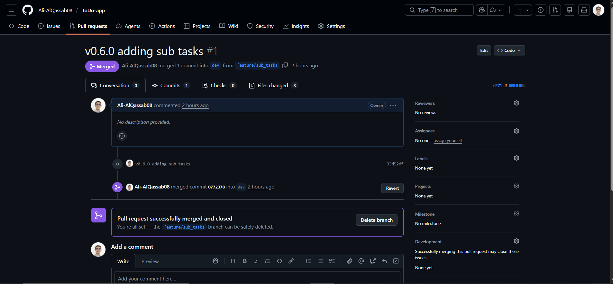

# Submission

Submit a single PDF or Markdown file containing:

## Branch list screenshot / output

- Evidence (screenshot):

## PR links (feature -> dev)

- PR 1: 
- PR 2: 
- PR 3: 

## PR link (dev -> main)

- PR: 

## DockerHub screenshot

- Evidence (screenshot or link): Screenshot of DockerHub tags page for `aliqassab/todo-app`.
- Notes (if any): Tags visible: `v1.0.0`, `v1.1.0`, `latest`.

## GitHub Release link

- Release URL: https://github.com/Ali-AlQassab08/ToDo-app/releases/tag/v1.1.0

## What I learned about branching + merging (short paragraph)
I learned that short-lived feature branches keep changes focused and make code review easier. Merging into `dev` first helps catch integration issues early, and a final merge into `main` should be clean and predictable. Using clear branch names and small, reviewed PRs reduces conflicts and speeds up delivery.

## Git workflow 

- Summary: Created feature branches from `dev`, opened PRs for review, and used a final `dev` -> `main` merge for release.

## Features implemented 

- Summary: CRUD Operations, Task Descriptions + Metadata, Tags/Labels, Task Stats Dashboard, Kanban board, graph with progression, daily streak, Drag-and-drop task ordering and exporting to CSV or json.

