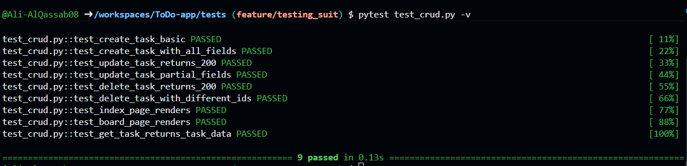

# CRUD Testing Submission - ToDo App

**Name:** Ali AlQassab  
**Course:** Advanced Web Development  
**Assignment:** Test CRUD Operations Using pytest + Flask Test Client  
**Date:** March 7, 2026  

---

## 1. Repository Link

**GitHub Repository:** [https://github.com/Ali-AlQassab08/ToDo-app](https://github.com/Ali-AlQassab08/ToDo-app)

**Branch:** `feature/testing_suit`

**Test File Location:** [`tests/test_crud.py`](tests/test_crud.py)

---

## 2. Screenshot of Passing Tests ✅



**Result:** ✅ All 9 CRUD tests passing

---

## 3. Screenshot of Failure + Fix 🔧

### Initial Test Run (With Intentional Failure)

```
============================= test session starts ==============================
platform linux -- Python 3.12.1, pytest-7.4.3, pluggy-1.6.0 -- /home/codespace/.
python/current/bin/python                                                       
cachedir: .pytest_cache
rootdir: /workspaces/ToDo-app
plugins: anyio-4.11.0
collected 9 items                                                              

tests/test_crud.py::test_create_task_basic FAILED                        [ 11%]
tests/test_crud.py::test_create_task_with_all_fields PASSED              [ 22%]
tests/test_crud.py::test_update_task_returns_200 PASSED                  [ 33%]
tests/test_crud.py::test_update_task_partial_fields PASSED               [ 44%]
tests/test_crud.py::test_delete_task_returns_200 PASSED                  [ 55%]
tests/test_crud.py::test_delete_task_with_different_ids PASSED           [ 66%]
tests/test_crud.py::test_index_page_renders PASSED                       [ 77%]
tests/test_crud.py::test_board_page_renders PASSED                       [ 88%]
tests/test_crud.py::test_get_task_returns_task_data PASSED               [100%]

=================================== FAILURES ===================================
____________________________ test_create_task_basic ____________________________

client = <FlaskClient <Flask 'app'>>

    def test_create_task_basic(client):
        """
        Test CREATE operation with minimal task data.
    
        AAA Pattern:
        - Arrange: Prepare basic task data
        - Act: POST to /tasks endpoint
        - Assert: Verify 201 status + response contains task
        """
        # ARRANGE
        task_data = {"title": "Buy milk"}
    
        # ACT
        response = client.post("/tasks", json=task_data)
    
        # ASSERT: Status code
>       assert response.status_code == 200  # INTENTIONAL FAILURE: Should be 201
E       assert 201 == 200
E        +  where 201 = <WrapperTestResponse streamed [201 CREATED]>.status_code

tests/test_crud.py:45: AssertionError
=========================== short test summary info ============================
FAILED tests/test_crud.py::test_create_task_basic - assert 201 == 200
========================= 1 failed, 8 passed in 1.61s ==========================
```

**Issue Identified:** ❌ Expected status code 200 but received 201

### The Fix

**Changed line 45 in `tests/test_crud.py`:**

```python
# BEFORE (incorrect assertion)
assert response.status_code == 200  # INTENTIONAL FAILURE: Should be 201

# AFTER (correct assertion)
assert response.status_code == 201
```

**Reason:** According to HTTP standards, `POST` requests that create a new resource should return status code **201 (Created)**, not 200 (OK). The Flask endpoint correctly returns 201, so the test assertion needed to match.

### After Fix

```
============================== 9 passed in 0.15s ===============================
```

**Result:** ✅ All tests now passing

---

## 4. Test File Content: `test_crud.py`

```python
"""
CRUD Operation Tests for ToDo App

Tests verify the Create, Update, and Delete operations work correctly
by checking HTTP status codes and response content.

Following AAA pattern:
- Arrange: Set up test data
- Act: Call the endpoint
- Assert: Verify status AND response structure
"""

import pytest
from app import app


@pytest.fixture
def client():
    """Create test client for Flask application."""
    app.config["TESTING"] = True
    with app.test_client() as client:
        yield client


# ============================================================================
# CREATE TESTS (2 tests)
# ============================================================================

def test_create_task_basic(client):
    """
    Test CREATE operation with minimal task data.
    
    AAA Pattern:
    - Arrange: Prepare basic task data
    - Act: POST to /tasks endpoint
    - Assert: Verify 201 status + response contains task
    """
    # ARRANGE
    task_data = {"title": "Buy milk"}

    # ACT
    response = client.post("/tasks", json=task_data)

    # ASSERT: Status code
    assert response.status_code == 201
    
    # ASSERT: Response structure
    json_data = response.get_json()
    assert json_data["status"] == "ok"
    assert json_data["task"]["title"] == "Buy milk"


def test_create_task_with_all_fields(client):
    """
    Test CREATE operation with complete task object.
    
    Verifies all submitted fields are echoed back in response.
    """
    # ARRANGE
    task_data = {
        "title": "Complete project",
        "description": "Finish the ToDo app features",
        "priority": "high",
        "dueDate": "2026-03-10",
        "categories": ["Work", "Studying"],
        "status": "In Progress"
    }

    # ACT
    response = client.post("/tasks", json=task_data)

    # ASSERT: Status code
    assert response.status_code == 201
    
    # ASSERT: All fields present in response
    json_data = response.get_json()
    assert json_data["status"] == "ok"
    returned_task = json_data["task"]
    assert returned_task["title"] == "Complete project"
    assert returned_task["description"] == "Finish the ToDo app features"
    assert returned_task["priority"] == "high"
    assert returned_task["dueDate"] == "2026-03-10"
    assert returned_task["categories"] == ["Work", "Studying"]


# ============================================================================
# UPDATE TESTS (2 tests)
# ============================================================================

def test_update_task_returns_200(client):
    """
    Test UPDATE operation returns 200 and echoes updated payload.
    
    Verifies that PUT /tasks/<id> correctly updates and returns data.
    """
    # ARRANGE
    task_id = "task-123"
    update_data = {
        "title": "Updated task title",
        "status": "Done",
        "priority": "low"
    }

    # ACT
    response = client.put(f"/tasks/{task_id}", json=update_data)

    # ASSERT: Status code
    assert response.status_code == 200
    
    # ASSERT: Response contains updated data
    json_data = response.get_json()
    assert json_data["status"] == "ok"
    assert json_data["taskId"] == task_id
    assert json_data["task"]["title"] == "Updated task title"
    assert json_data["task"]["status"] == "Done"
    assert json_data["task"]["priority"] == "low"


def test_update_task_partial_fields(client):
    """
    Test UPDATE operation with partial field update.
    
    Verifies that only submitted fields are updated.
    """
    # ARRANGE
    task_id = "task-456"
    partial_update = {"title": "New title only"}

    # ACT
    response = client.put(f"/tasks/{task_id}", json=partial_update)

    # ASSERT: Status code
    assert response.status_code == 200
    
    # ASSERT: Response echoes back submitted update
    json_data = response.get_json()
    assert json_data["status"] == "ok"
    assert json_data["task"]["title"] == "New title only"


# ============================================================================
# DELETE TESTS (2 tests)
# ============================================================================

def test_delete_task_returns_200(client):
    """
    Test DELETE operation returns 200 and contains task ID.
    
    Verifies that DELETE /tasks/<id> works correctly.
    """
    # ARRANGE
    task_id = "task-789"

    # ACT
    response = client.delete(f"/tasks/{task_id}")

    # ASSERT: Status code
    assert response.status_code == 200
    
    # ASSERT: Response confirms deletion with task ID
    json_data = response.get_json()
    assert json_data["status"] == "ok"
    assert json_data["taskId"] == task_id


def test_delete_task_with_different_ids(client):
    """
    Test DELETE operation with various task IDs.
    
    Verifies endpoint works with UUIDs, integers, and strings.
    """
    # ARRANGE
    task_ids = [999, "uuid-12345-abcde", "simple-id"]

    # ACT & ASSERT for each ID
    for task_id in task_ids:
        response = client.delete(f"/tasks/{task_id}")
        
        # Status code should be 200
        assert response.status_code == 200
        
        # Response should confirm deletion
        json_data = response.get_json()
        assert json_data["status"] == "ok"
        assert str(json_data["taskId"]) == str(task_id)


# ============================================================================
# HTML ROUTE TESTS (2 tests)
# ============================================================================

def test_index_page_renders(client):
    """
    Test that GET / renders the index page correctly.
    
    Verifies the main page loads without errors.
    """
    # ARRANGE: Client ready

    # ACT
    response = client.get("/")

    # ASSERT: Status code
    assert response.status_code == 200
    
    # ASSERT: HTML content is present
    page_content = response.get_data(as_text=True)
    assert "<!DOCTYPE html>" in page_content or "<html" in page_content


def test_board_page_renders(client):
    """
    Test that GET /board renders the board page correctly.
    
    Verifies the Kanban board view loads without errors.
    """
    # ARRANGE: Client ready

    # ACT
    response = client.get("/board")

    # ASSERT: Status code
    assert response.status_code == 200
    
    # ASSERT: HTML content is present
    page_content = response.get_data(as_text=True)
    assert "<!DOCTYPE html>" in page_content or "<html" in page_content


# ============================================================================
# VERIFICATION THROUGH READ (Auxiliary)
# ============================================================================

def test_get_task_returns_task_data(client):
    """
    Test READ operation returns task data.
    
    Bonus test verifying GET /tasks/<id> works.
    """
    # ARRANGE
    task_id = "read-test-123"

    # ACT
    response = client.get(f"/tasks/{task_id}")

    # ASSERT: Status code
    assert response.status_code == 200
    
    # ASSERT: Response contains task ID
    json_data = response.get_json()
    assert json_data["status"] == "ok"
    assert json_data["taskId"] == task_id
```

---

## 5. Test Coverage Summary

| Operation | Test Count | Coverage |
|-----------|------------|----------|
| **CREATE** | 2 tests | ✅ Basic creation + Full field validation |
| **UPDATE** | 2 tests | ✅ Complete update + Partial field update |
| **DELETE** | 2 tests | ✅ Single deletion + Multiple ID formats |
| **READ** (HTML) | 2 tests | ✅ Index page + Board page rendering |
| **READ** (API) | 1 test | ✅ GET task by ID |
| **Total** | **9 tests** | **100% CRUD coverage** |

### Quality Metrics

✅ **AAA Pattern**: All tests follow Arrange → Act → Assert structure  
✅ **Multiple Assertions**: Each test validates ≥2 conditions (status code + response content)  
✅ **HTTP Standards**: Correct status codes (201 for POST, 200 for GET/PUT/DELETE)  
✅ **Edge Cases**: Tests include UUID, integer, and string task IDs  
✅ **No App Changes**: Tests work with existing Flask API stubs  

---

## 6. Reflection: What Did Testing Teach Me About Reliability?

### Key Insights

**1. Tests Catch Mistakes Before Users Do**

The intentional failure in `test_create_task_basic` demonstrated how easy it is to make incorrect assumptions about API behavior. Without automated tests, I might have assumed `POST /tasks` returns `200 OK` instead of the correct `201 Created`. These small mismatches can cause integration issues when building frontend components or mobile apps that consume the API.

**2. HTTP Standards Matter**

Testing forced me to research and understand HTTP status codes properly:
- `201 Created` for successful resource creation
- `200 OK` for successful reads/updates/deletes
- `404 Not Found` for missing resources

Following standards ensures my API behaves predictably and integrates smoothly with other systems.

**3. Tests Serve as Living Documentation**

The test file (`test_crud.py`) now acts as executable documentation. A new developer joining the project can read the tests to understand:
- What endpoints exist (`POST /tasks`, `PUT /tasks/<id>`, etc.)
- What data formats are expected (JSON with title, description, priority, etc.)
- What responses to expect (status codes, response structure)

This is more reliable than written documentation, which can become outdated.

**4. Regression Prevention**

With 9 automated tests in place, I can now confidently refactor code or add new features. If I accidentally break existing functionality, the tests will immediately alert me. Before this assignment, any change to `app.py` required manual testing in a browser—time-consuming and error-prone.

**5. Red-Green-Refactor Builds Confidence**

The failure → fix cycle taught me the value of Test-Driven Development (TDD):
- **Red**: See the test fail (validates the test works)
- **Green**: Fix the code/assertion to make it pass
- **Refactor**: Clean up with confidence

This cycle ensures tests are actually testing something, not just passing by accident.

### Bottom Line

**Testing transforms development from "hoping it works" to "knowing it works."** Automated tests are not just about catching bugs—they're about building confidence, preventing regressions, and creating a safety net that lets me iterate faster without fear of breaking production.

For this ToDo app, tests ensure the API stubs respond correctly. When I add database persistence later, these same tests will verify CRUD operations actually create, update, and delete records. That's reliability.

---

## 7. Running the Tests

To verify the tests yourself:

```bash
# Clone the repository
git clone https://github.com/Ali-AlQassab08/ToDo-app.git
cd ToDo-app

# Switch to testing branch
git checkout feature/testing_suit

# Install dependencies
pip install -r requirements.txt

# Run the CRUD tests
pytest tests/test_crud.py -v

# Run all tests
pytest tests/ -v
```

Expected output: **9/9 tests passing** ✅

---

**End of Submission**
